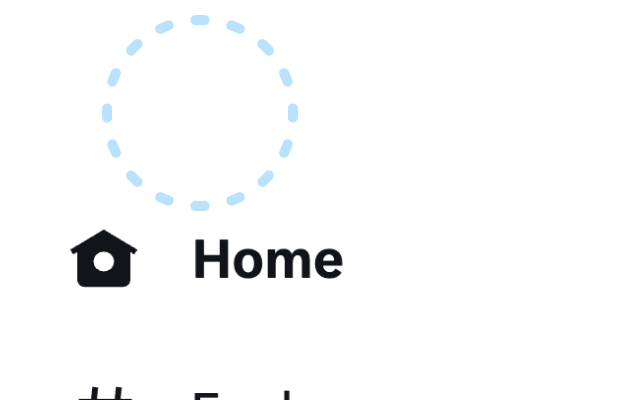
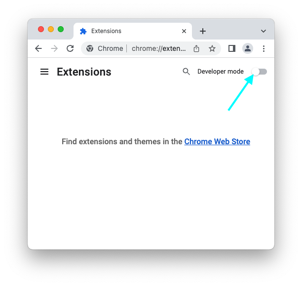
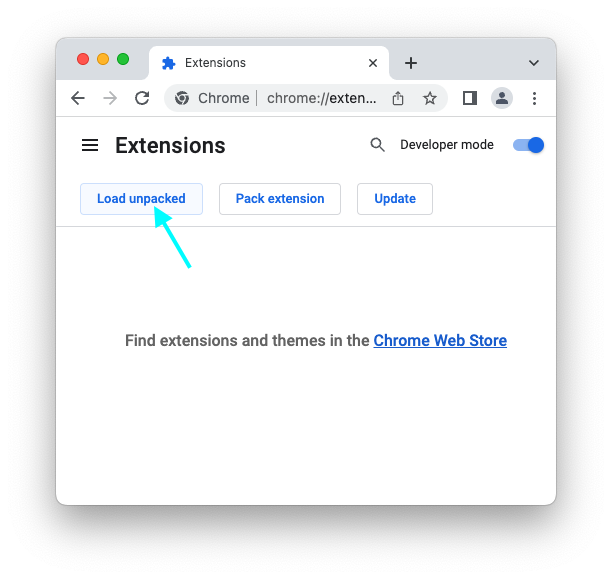
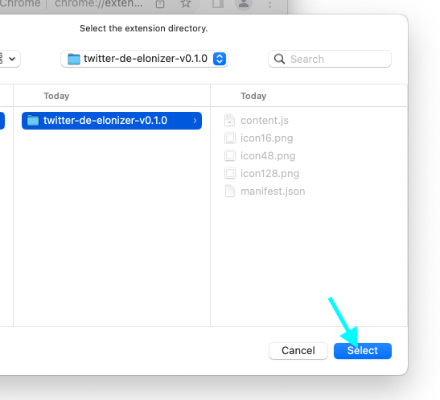
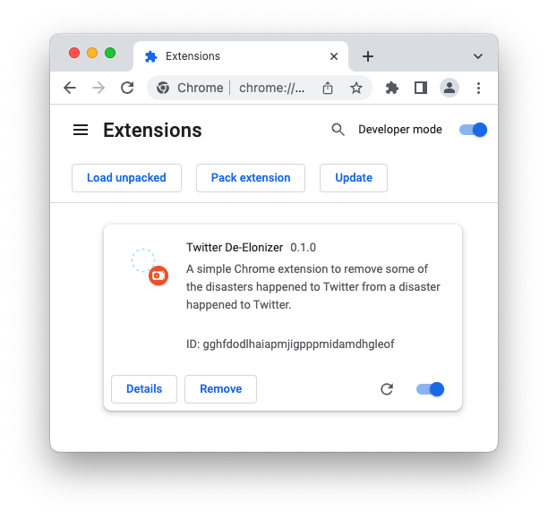

# Twitter De-Elonizer

A simple Chrome extension to remove some of the disasters happened to Twitter from a disaster happened to Twitter.

## Features

- Efficiently eliminates the distracting Doge logo.
- Restores the classic Twitter appearance for a familiar browsing experience.
- Mindfully acknowledges the current era of Twitter by refraining from reinstating the blue bird logo.

## Installation

1. Clone this repository or [download it](https://github.com/sehyunchung/twitter-de-elonizer/releases/download/0.1.0/twittter-de-elonizer-v0.1.0.zip) as a .zip file and extract it to a folder.
1. Open Google Chrome and navigate to chrome://extensions.
1. Enable "Developer mode" by toggling the switch in the top-right corner of the page.
   
1. Click "Load unpacked" and select the folder containing the extension files.
   
   
1. "Twitter De-Elonizer" extension is now installed and ready to use.
   

## Usage

The extension will automatically remove the Doge logo from Elon Musk's Twitter profile when you visit the site. There is no need for any user interaction or configuration.

## Contributing

We welcome contributions to improve the extension or fix any issues. To contribute, please:

- Fork the repository.
- Create a new branch for your changes.
- Implement your changes and test them in the Chrome browser.
- Submit a pull request with a detailed description of your changes.

## License

This project is licensed under the MIT License. See the LICENSE file for details.
